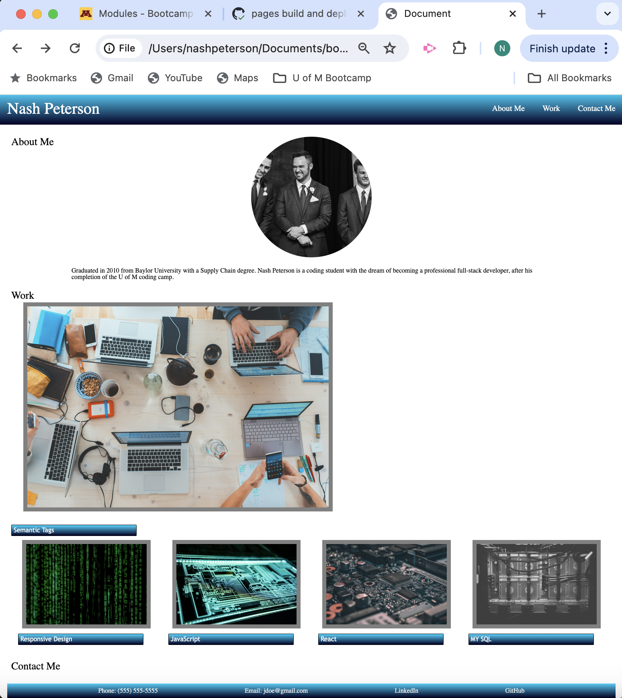

# Advanced CSS Homework

For this assignment, I created a responsive portfolio project with the following parameters:

- Web page featuring:
    - Developer's name
    - Recent photo 
    - Navigation links, allowing the UI to jump to the following sections: 
        - about me
        - work
        - contact me
    - Sample a potential employee's previous work, including a link to the deployed site (embedded in image).
    - Previous work sample application image is larger than the four other images below it.
    - Using Flex CSS & Media queries to allow for a responsive layout for multiple viewport sizes (desktop & mobile).

## Link to Deployed Version

[Click here to see the deployed version](https://teutonicted.github.io/advanced-css-homework/)

## Screenshot of the Deployed Version

